# 프로젝트 - 입사 지원서 포트폴리오

## 프로젝트 구성

## 기술 스택
Language:    Java 
Framework:   Spring Boot
Build:       Gradle
ORM:         Spring Data JPA, Hibernate
Security:    Spring Security, JWT
Database:    MySQL, H2 InMemory
Cache:       Redis 7
Docs:        SpringDoc OpenAPI 3(Swagger UI)
Container:   Docker, Docker Compose
CI/CD:       Github Actions
## 프로젝트 - 입사지원서 포트폴리오 

### 핵심 구현
-
-
-
-
-

## 빠른 시작
### 사전 준비
- JDK 21
- Gradle

### 프로젝트 실행

# 접속
# SWAGGER

## 커밋 컨벤션
```
feat:       새로운 기능 추가
fix:        버그 수정
refactor:   코드 리팩토링
test:       테스트 코드
docs:       문서 수정
chore:      빌드, 설정 변경
```

# 📝 My Spring Boot Project

> 회원 게시판 REST API (Spring Boot 3 + JPA + MySQL)

---

## 🗄️ ERD (Entity Relationship Diagram)

```mermaid
erDiagram
    direction TB

    USER ||--o{ POST : writes
    USER ||--o{ COMMENT : creates
    USER ||--|| PROFILE : has
    POST ||--o{ COMMENT : "receives"

    USER {
        bigint id PK
        string email UK
        string password
        string nickname
        timestamp created_at
    }

    PROFILE {
        bigint id PK
        bigint user_id FK
        string bio
        string profile_image_url
    }

    POST {
        bigint id PK
        bigint user_id FK
        string title
        text content
        int view_count
        timestamp created_at
    }

    COMMENT {
        bigint id PK
        bigint post_id FK
        bigint user_id FK
        text content
        timestamp created_at
    }
```



---

## 🧩 Spring Boot JPA 엔티티 코드

### 1️⃣ User.java

```java
package com.example.demo.entity;

import jakarta.persistence.*;
import lombok.*;
import java.time.LocalDateTime;
import java.util.ArrayList;
import java.util.List;

@Entity
@Table(name = "users")
@Getter
@NoArgsConstructor(access = AccessLevel.PROTECTED)
@AllArgsConstructor
@Builder
public class User {

    @Id
    @GeneratedValue(strategy = GenerationType.IDENTITY)
    private Long id;

    @Column(unique = true, nullable = false, length = 100)
    private String email;

    @Column(nullable = false)
    private String password;

    @Column(length = 50)
    private String nickname;

    @Column(name = "created_at", updatable = false)
    private LocalDateTime createdAt;

    // === 연관관계 ===
    @OneToOne(mappedBy = "user", cascade = CascadeType.ALL, orphanRemoval = true)
    private Profile profile;

    @OneToMany(mappedBy = "user", cascade = CascadeType.ALL, orphanRemoval = true)
    private List<Post> posts = new ArrayList<>();

    @OneToMany(mappedBy = "user", cascade = CascadeType.ALL, orphanRemoval = true)
    private List<Comment> comments = new ArrayList<>();

    @PrePersist
    protected void onCreate() {
        this.createdAt = LocalDateTime.now();
    }

    // 연관관계 편의 메서드
    public void addPost(Post post) {
        this.posts.add(post);
        post.setUser(this);
    }

    public void setProfile(Profile profile) {
        this.profile = profile;
        profile.setUser(this);
    }
}
```

---

### 2️⃣ Profile.java

```java
package com.example.demo.entity;

import jakarta.persistence.*;
import lombok.*;

@Entity
@Getter
@NoArgsConstructor(access = AccessLevel.PROTECTED)
@AllArgsConstructor
@Builder
public class Profile {

    @Id
    @GeneratedValue(strategy = GenerationType.IDENTITY)
    private Long id;

    private String bio;

    @Column(name = "profile_image_url")
    private String profileImageUrl;

    // === 연관관계 (양방향) ===
    @OneToOne(fetch = FetchType.LAZY)
    @JoinColumn(name = "user_id", nullable = false)
    private User user;

    public void setUser(User user) {
        this.user = user;
    }
}
```

---

### 3️⃣ Post.java

```java
package com.example.demo.entity;

import jakarta.persistence.*;
import lombok.*;
import java.time.LocalDateTime;
import java.util.ArrayList;
import java.util.List;

@Entity
@Getter
@NoArgsConstructor(access = AccessLevel.PROTECTED)
@AllArgsConstructor
@Builder
public class Post {

    @Id
    @GeneratedValue(strategy = GenerationType.IDENTITY)
    private Long id;

    @Column(length = 200, nullable = false)
    private String title;

    @Column(columnDefinition = "TEXT")
    private String content;

    @Column(name = "view_count", columnDefinition = "int default 0")
    private int viewCount;

    @Column(name = "created_at", updatable = false)
    private LocalDateTime createdAt;

    // === 연관관계 ===
    @ManyToOne(fetch = FetchType.LAZY)
    @JoinColumn(name = "user_id", nullable = false)
    private User user;

    @OneToMany(mappedBy = "post", cascade = CascadeType.ALL, orphanRemoval = true)
    private List<Comment> comments = new ArrayList<>();

    @PrePersist
    protected void onCreate() {
        this.createdAt = LocalDateTime.now();
        this.viewCount = 0;
    }

    public void setUser(User user) {
        this.user = user;
    }
}
```

---

### 4️⃣ Comment.java

```java
package com.example.demo.entity;

import jakarta.persistence.*;
import lombok.*;
import java.time.LocalDateTime;

@Entity
@Getter
@NoArgsConstructor(access = AccessLevel.PROTECTED)
@AllArgsConstructor
@Builder
public class Comment {

    @Id
    @GeneratedValue(strategy = GenerationType.IDENTITY)
    private Long id;

    @Column(columnDefinition = "TEXT", nullable = false)
    private String content;

    @Column(name = "created_at", updatable = false)
    private LocalDateTime createdAt;

    // === 연관관계 ===
    @ManyToOne(fetch = FetchType.LAZY)
    @JoinColumn(name = "post_id", nullable = false)
    private Post post;

    @ManyToOne(fetch = FetchType.LAZY)
    @JoinColumn(name = "user_id", nullable = false)
    private User user;

    @PrePersist
    protected void onCreate() {
        this.createdAt = LocalDateTime.now();
    }
}
```

---

## 🔗 연관관계 매핑 요약

| 관계 | 설명 | JPA 어노테이션 |
|------|------|----------------|
| User ↔ Profile | 1:1 양방향 | `@OneToOne`, `mappedBy` |
| User → Post | 1:N 단방향 (양방향으로 설정) | `@OneToMany(mappedBy)` |
| User → Comment | 1:N 양방향 | `@OneToMany(mappedBy)` |
| Post → Comment | 1:N 양방향 | `@OneToMany(mappedBy)` |
| Post → User | N:1 단방향 | `@ManyToOne` + `@JoinColumn` |
| Comment → User | N:1 단방향 | `@ManyToOne` + `@JoinColumn` |
| Comment → Post | N:1 단방향 | `@ManyToOne` + `@JoinColumn` |

---

## 🛠️ 기술 스택

- **Backend**: Spring Boot 3.2.x, Spring Data JPA
- **Database**: MySQL 8.0
- **ORM**: Hibernate 6.x
- **Build**: Gradle
- **Java**: JDK 17
